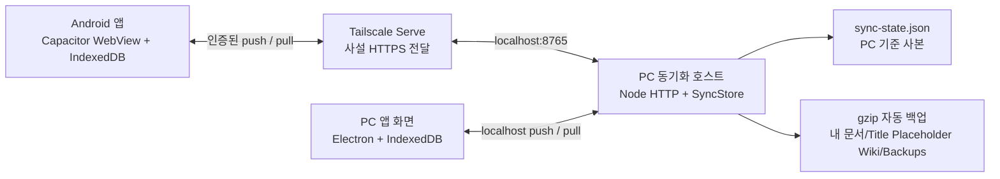

# 아키텍처와 데이터 흐름

## 목표

Title:Placeholder Wiki 2.0은 다음 조건을 우선합니다.

- 월 비용이 드는 중앙 서버 없이 사용
- PC와 휴대폰 모두 완전한 로컬 사본 보유
- PC가 꺼져도 휴대폰에서 읽기·편집 가능
- 다시 연결됐을 때 변경을 안전하게 합치기
- 동시 편집을 조용히 덮어쓰지 않기
- 같은 정적 UI를 Windows와 Android에서 재사용

## 구성 요소

### 정적 앱 화면

Vite가 HTML, CSS, JavaScript를 정적 파일로 빌드합니다. 브라우저/PWA에서는 서비스 워커가 앱 화면을 캐시하고, Electron과 Capacitor에서는 같은 `dist`를 각 네이티브 셸이 로드합니다. 화면을 표시하는 데 별도 백엔드나 외부 웹 호스팅이 필요하지 않습니다.

### 기기 로컬 저장소

각 화면은 PouchDB를 사용해 IndexedDB에 전체 위키를 저장합니다. 작성 버튼을 누르면 먼저 로컬 저장이 끝나므로 네트워크 응답을 기다리지 않습니다. 로컬 설정, 동기화 체크포인트와 아직 보내지 않은 변경도 기기 안에 보관됩니다.

### PC 동기화 호스트

Electron 메인 프로세스는 `127.0.0.1:8765`에서 정적 앱과 동기화 API를 제공합니다. PC 기준 사본은 앱 사용자 데이터 폴더의 `wiki-data/sync-state.json`에 원자적으로 기록됩니다. 실제 경로는 설치 방식과 Windows 사용자에 따라 달라질 수 있으므로 설정 화면에 표시된 경로를 기준으로 합니다.

동기화 API는 한 요청당 변경 수와 문서 크기를 제한하고, PouchDB 내부 메타데이터를 제거한 애플리케이션 문서만 받습니다.

### Tailscale Serve

PC의 로컬 서버를 일반 인터넷에 직접 열지 않습니다. Tailscale Serve가 tailnet 내부의 `https://<기기>.<tailnet>.ts.net` 주소를 PC의 localhost로 전달합니다. 전송은 HTTPS이며 동기화 API는 별도 Basic 자격 증명도 요구합니다.

Tailscale은 네트워크 접근 범위를 제한하지만 데이터 자체를 종단 간 암호화된 백업으로 보관해 주는 서비스는 아닙니다. 앱 데이터와 백업 보존 책임은 사용자에게 있습니다.

## 문서 모델

주요 데이터 유형은 다음과 같습니다.

- `node`: 폴더 또는 페이지의 제목, 상위 항목, 상태, 태그와 순서
- `block`: 텍스트, 이미지, YouTube, Sheets, 강조 상자, 구분선
- `asset`: 이미지 본문과 메타데이터
- `revision`: 저장 시점의 수정 기록
- `tombstone`: 삭제/휴지통 상태를 전달하는 표식
- 로컬 설정: 기기 ID, 서버 주소, 체크포인트
- outbox/conflict: 보내지 않은 변경과 충돌 사본

폴더와 문서는 안정적인 ID로 연결합니다. 화면 순서는 항목 사이에 새 키를 만들 수 있는 순서 키로 저장하므로, 드래그 한 번에 전체 목록 번호를 다시 쓰지 않아도 됩니다.

서식 텍스트는 저장 전에 정제합니다. 실행 스크립트, 이벤트 핸들러와 위험한 iframe은 제거하고 외부 임베드는 허용된 YouTube/Google 도메인으로 제한합니다.

## 동기화 프로토콜

모든 변경에는 다음 정보가 들어갑니다.

- 변경 자체를 중복 구분하는 `changeId`
- 변경한 기기를 나타내는 `deviceId`
- 새 문서의 `version`
- 편집을 시작한 기준인 `baseVersion`
- 실제 애플리케이션 문서

흐름은 다음과 같습니다.

1. 로컬 저장소에 문서와 append-only outbox 변경을 함께 기록합니다.
2. 클라이언트가 아직 확인받지 못한 변경 묶음을 PC로 push합니다.
3. PC는 `changeId` 중복을 제거합니다.
4. 서버의 현재 버전이 `baseVersion`과 같으면 새 버전을 적용합니다.
5. 다르면 현재 사본과 들어온 사본을 conflict 레코드로 보존합니다.
6. 클라이언트는 체크포인트 이후의 서버 변경을 pull합니다.
7. 적용이 끝난 변경만 outbox에서 확인 처리합니다.

네트워크가 중간에 끊겨 같은 변경을 다시 보내도 `changeId`로 중복 적용을 막습니다. 서버 변경 로그와 체크포인트를 사용해 다음 동기화에서 이어받습니다.

## 충돌 정책

마지막 저장 시각만 비교하는 자동 승자 결정은 사용하지 않습니다. 서로 같은 기준 버전에서 갈라진 변경은 양쪽 원문과 버전 정보를 보존한 뒤 사용자가 선택하거나 합치게 합니다.

이 정책은 자동 병합보다 사용자의 확인이 한 번 더 필요하지만, 무기 수치나 시스템 설계처럼 작은 차이도 중요한 위키에서 조용한 데이터 손실을 막습니다.

서로 다른 문서 편집이나 같은 문서에 대한 순차 편집은 일반 동기화로 처리되며 충돌이 아닙니다.

## 백업

사용자 JSON 내보내기는 다른 기기나 새 설치로 옮길 수 있는 일반 복구 형식입니다. Electron 동기화 호스트의 자동 백업도 같은 문서 배열 형식을 gzip으로 압축하므로 앱의 가져오기 화면에서 직접 복구할 수 있습니다.

- 생성 시점: 앱 시작, 하루 간격, 수동 요청
- 기본 위치: `내 문서\Title Placeholder Wiki\Backups`
- 보존: 최신 30개
- 포함: 현재 문서, 구조, 블록, 이력, 휴지통 기록과 이미지 데이터

자동 파일명은 `.wiki-backup.json.gz`로 끝납니다. 설정의 가져오기 기능이 압축을 풀고 무결성을 검증한 뒤 병합하거나 교체합니다. 실행 중인 `sync-state.json`을 직접 덮어쓰는 방식은 지원하지 않습니다.

## 보안 경계

보호 수단:

- localhost에만 바인딩한 PC 원본 서버
- Tailscale tailnet 기기 인증과 HTTPS
- API 사용자명/무작위 비밀번호
- 브라우저 컨텍스트 격리와 Node 통합 비활성화
- 외부 URL/HTML 정제와 콘텐츠 보안 정책
- 동기화 요청 크기와 식별자 검증

범위 밖 또는 사용자 책임:

- 잠금 해제된 PC나 휴대폰에 대한 로컬 접근
- Windows/Android 계정 간 앱 내부 역할 분리
- 공개 Google Sheets 데이터의 접근 통제
- YouTube/Google 서비스의 추적과 가용성
- 디스크 암호화, 백업 암호화와 자격 증명 보관
- 상용 코드 서명과 앱 스토어 심사

## 알려진 한계와 운영 특성

- Windows x64와 Android만 패키징합니다. iOS 앱은 없습니다.
- PC 동기화 호스트가 꺼져 있으면 다른 기기로 변경이 전달되지 않지만 로컬 편집은 계속됩니다.
- 모바일 OS가 앱을 종료하면 자동 백그라운드 동기화를 보장하지 않습니다.
- Google Sheets와 YouTube의 실제 콘텐츠는 네트워크가 필요하며 오프라인 캐시에 복제하지 않습니다.
- 대용량 이미지와 긴 수정 이력은 저장 공간, 백업 크기와 초기 동기화 시간을 늘립니다.
- 앱 셸은 정적이지만 위키 데이터는 Git 파일이 아니라 기기 데이터베이스에 있습니다. GitHub Pages 자동 게시 기능은 2.0.0 범위에 포함되지 않습니다.
- EXE는 Authenticode 무서명이며 APK는 개인 릴리스 키로 서명된 사이드로드 패키지입니다.
